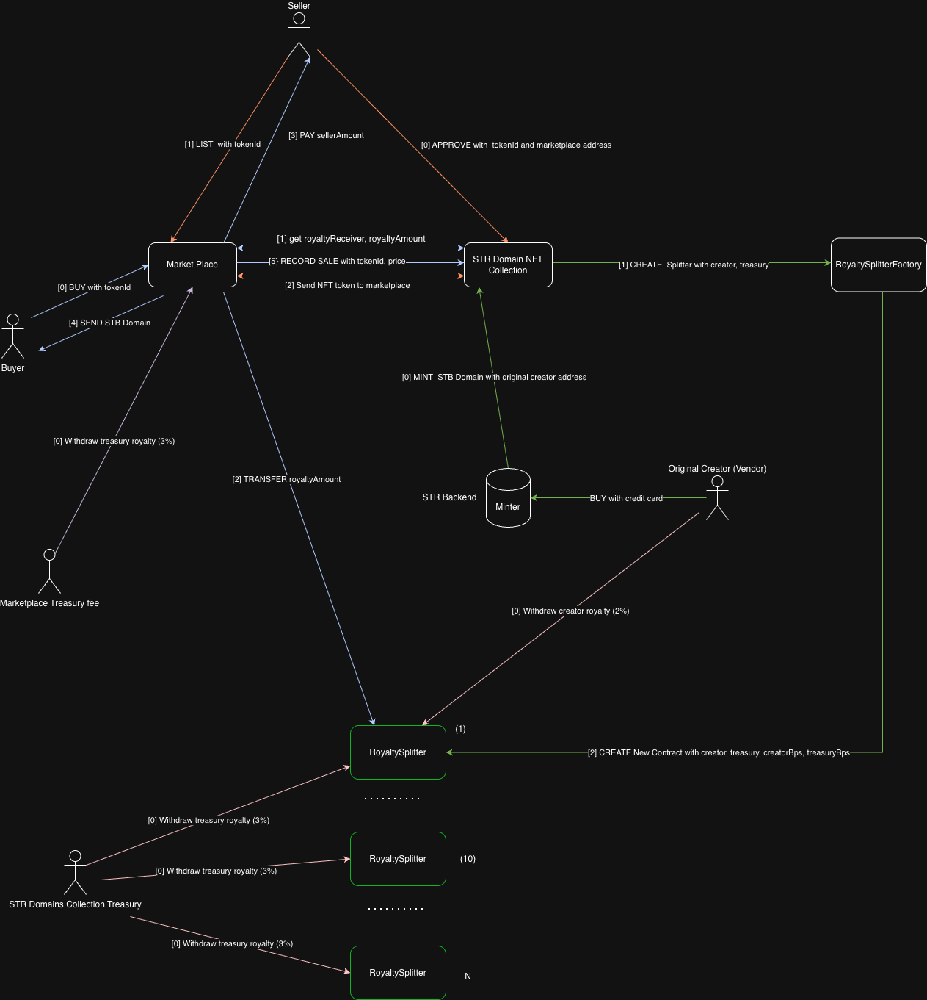

# System Contracts Documentation



## Overview
This document provides comprehensive documentation for four smart contracts in the StrDomains NFT ecosystem:

1. **StrDomainsNFT.sol** - ERC721 NFT contract with royalty support
2. **Marketplace.sol** - NFT marketplace for buying and selling
3. **RoyaltySplitter.sol** - Contract for splitting royalty payments
4. **RoyaltySplitterFactory.sol** - Factory for creating RoyaltySplitter instances

---

## 1. StrDomainsNFT.sol

### Contract Description
ERC721 NFT contract with EIP-2981 royalty support, access control, and per-token royalty splitters. Each token has a creator, minting timestamp, sale history tracking, and a unique domain name with bidirectional mappings (domain ↔ tokenId).

### State Variables
- `MINTER_ROLE`: Role for minting new tokens
- `SALES_ROLE`: Role for recording sales
- `DEFAULT_ROYALTY_BPS`: Default royalty percentage (500 = 5%)
- `CREATOR_SHARE_IN_ROY`: Creator's share of royalties (4000 = 40%)
- `TREASURY_SHARE_IN_ROY`: Treasury's share of royalties (6000 = 60%)
- `_lastId`: Last minted token ID
- `treasury`: Treasury address for royalty collection
- `splitterFactory`: Factory for creating royalty splitters
- `_domainToTokenId`: Mapping from domain names to token IDs
- `_tokenIdToDomain`: Reverse mapping from token IDs to domain names

### Functions

#### Constructor
```solidity
constructor(string memory name_, string memory symbol_, address treasury_, address splitterFactory_, uint96 /*ignored*/)
```
**Description**: Initializes the NFT contract with name, symbol, treasury, and splitter factory.

**Parameters**:
- `name_` (string): NFT collection name
- `symbol_` (string): NFT collection symbol
- `treasury_` (address): Treasury address for royalty collection
- `splitterFactory_` (address): Factory contract for creating royalty splitters
- `/*ignored*/` (uint96): Ignored parameter

**Returns**: None

**Events Emitted**:
- `DefaultRoyaltyUpdated`
- `SplitterFactoryUpdated`

#### mint
```solidity
function mint(address to, string memory uri, string memory domainName) external onlyRole(MINTER_ROLE) returns (uint256 tokenId)
```
**Description**: Mints a new NFT token to the specified address with the given URI and domain name.

**Parameters**:
- `to` (address): Address to mint the token to
- `uri` (string): Token URI metadata
- `domainName` (string): Domain name associated with the token

**Returns**:
- `tokenId` (uint256): The ID of the newly minted token

**Events Emitted**:
- `Minted`
- `TokenSplitterSet`

#### setTreasury
```solidity
function setTreasury(address newTreasury) external onlyRole(DEFAULT_ADMIN_ROLE)
```
**Description**: Updates the treasury address for royalty collection.

**Parameters**:
- `newTreasury` (address): New treasury address

**Returns**: None

**Events Emitted**:
- `TreasuryUpdated`
- `DefaultRoyaltyUpdated`

#### setSplitterFactory
```solidity
function setSplitterFactory(address newFactory) external onlyRole(DEFAULT_ADMIN_ROLE)
```
**Description**: Updates the splitter factory address.

**Parameters**:
- `newFactory` (address): New splitter factory address

**Returns**: None

**Events Emitted**:
- `SplitterFactoryUpdated`

#### getLastId
```solidity
function getLastId() external view returns (uint256)
```
**Description**: Returns the ID of the last minted token.

**Parameters**: None

**Returns**:
- `uint256`: The ID of the last minted token

#### getTokenDataByDomain
```solidity
function getTokenDataByDomain(string memory domainName) external view returns (address creator, uint64 mintedAt_, string memory uri, uint256 lastPrice, uint64 lastAt, uint256 tokenId)
```
**Description**: Returns comprehensive token data for a given domain name: creator, minting info, URI, sale history, and token ID.

**Parameters**:
- `domainName` (string): Domain name to look up

**Returns**:
- `creator` (address): Token creator address
- `mintedAt_` (uint64): Minting timestamp
- `uri` (string): Token URI
- `lastPrice` (uint256): Last sale price
- `lastAt` (uint64): Last sale timestamp
- `tokenId` (uint256): Token ID associated with the domain name

#### creatorOf
```solidity
function creatorOf(uint256 tokenId) external view returns (address)
```
**Description**: Returns the creator address of a specific token.

**Parameters**:
- `tokenId` (uint256): Token ID to query

**Returns**:
- `address`: Creator address of the token

#### mintedAt
```solidity
function mintedAt(uint256 tokenId) external view returns (uint64)
```
**Description**: Returns the minting timestamp of a specific token.

**Parameters**:
- `tokenId` (uint256): Token ID to query

**Returns**:
- `uint64`: Unix timestamp when the token was minted

#### lastSaleOf
```solidity
function lastSaleOf(uint256 tokenId) external view returns (uint256 price, uint64 at)
```
**Description**: Returns the last sale price and timestamp of a specific token.

**Parameters**:
- `tokenId` (uint256): Token ID to query

**Returns**:
- `price` (uint256): Last sale price in wei
- `at` (uint64): Unix timestamp of the last sale

#### getTokenData
```solidity
function getTokenData(uint256 tokenId) external view returns (address creator, uint64 mintedAt_, string memory uri, uint256 lastPrice, uint64 lastAt, string memory domainName)
```
**Description**: Returns comprehensive token data including creator, minting info, URI, sale history, and the associated domain name.

**Parameters**:
- `tokenId` (uint256): Token ID to query

**Returns**:
- `creator` (address): Token creator address
- `mintedAt_` (uint64): Minting timestamp
- `uri` (string): Token URI
- `lastPrice` (uint256): Last sale price
- `lastAt` (uint64): Last sale timestamp
- `domainName` (string): Domain associated with the token

#### recordSale
```solidity
function recordSale(uint256 tokenId, uint256 price, address buyer) external onlyRole(SALES_ROLE)
```
**Description**: Records a sale for a specific token (called by marketplace).

**Parameters**:
- `tokenId` (uint256): Token ID that was sold
- `price` (uint256): Sale price in wei
- `buyer` (address): Buyer address

**Returns**: None

**Events Emitted**:
- `SaleRecorded`

#### burn
```solidity
function burn(uint256 tokenId) public override onlyRole(DEFAULT_ADMIN_ROLE)
```
**Description**: Burns a token and cleans up associated domain mappings. Only contract admin can burn tokens.

**Parameters**:
- `tokenId` (uint256): Token ID to burn

**Returns**: None

**Access Control**: Only `DEFAULT_ADMIN_ROLE`

**Events Emitted**:
- `Transfer` (from ERC721)

---

## 2. Marketplace.sol

### Contract Description
NFT marketplace contract that handles listing, buying, and selling of NFTs with royalty support and marketplace fees.

### State Variables
- `ADMIN_ROLE`: Administrative role
- `marketplaceFeeBps`: Marketplace fee percentage in basis points
- `feeTreasury`: Address for collecting marketplace fees
- `accruedFees`: Accumulated marketplace fees
- `lastListingId`: Last created listing ID
- `listings`: Mapping of listing ID to Listing struct

### Structs

#### Listing
```solidity
struct Listing {
    address seller;
    address nft;
    uint256 tokenId;
    uint256 price;
    bool active;
}
```

### Functions

#### Constructor
```solidity
constructor(address _feeTreasury, uint96 _feeBps)
```
**Description**: Initializes the marketplace with fee treasury and fee percentage.

**Parameters**:
- `_feeTreasury` (address): Treasury address for marketplace fees
- `_feeBps` (uint96): Marketplace fee in basis points

**Returns**: None

#### setMarketplaceFeeBps
```solidity
function setMarketplaceFeeBps(uint96 feeBps) external onlyRole(ADMIN_ROLE)
```
**Description**: Updates the marketplace fee percentage.

**Parameters**:
- `feeBps` (uint96): New fee percentage in basis points (max 2000 = 20%)

**Returns**: None

#### setFeeTreasury
```solidity
function setFeeTreasury(address t) external onlyRole(ADMIN_ROLE)
```
**Description**: Updates the fee treasury address.

**Parameters**:
- `t` (address): New treasury address

**Returns**: None

#### withdrawFees
```solidity
function withdrawFees() external onlyRole(ADMIN_ROLE) nonReentrant
```
**Description**: Withdraws accumulated marketplace fees to the treasury.

**Parameters**: None

**Returns**: None

**Events Emitted**:
- `FeeWithdrawn`

#### listToken
```solidity
function listToken(address nft, uint256 tokenId, uint256 price) external returns (uint256 listingId)
```
**Description**: Lists an NFT for sale on the marketplace.

**Parameters**:
- `nft` (address): NFT contract address
- `tokenId` (uint256): Token ID to list
- `price` (uint256): Listing price in wei

**Returns**:
- `listingId` (uint256): ID of the created listing

**Events Emitted**:
- `Listed`

#### updateListing
```solidity
function updateListing(uint256 listingId, uint256 newPrice) external
```
**Description**: Updates the price of an existing listing.

**Parameters**:
- `listingId` (uint256): Listing ID to update
- `newPrice` (uint256): New listing price in wei

**Returns**: None

**Events Emitted**:
- `ListingUpdated`

#### cancelListing
```solidity
function cancelListing(uint256 listingId) external nonReentrant
```
**Description**: Cancels an active listing and returns the NFT to the seller.

**Parameters**:
- `listingId` (uint256): Listing ID to cancel

**Returns**: None

**Events Emitted**:
- `ListingCanceled`

#### buy
```solidity
function buy(uint256 listingId) external payable nonReentrant
```
**Description**: Purchases an NFT from a listing.

**Parameters**:
- `listingId` (uint256): Listing ID to purchase

**Returns**: None

**Events Emitted**:
- `Purchased`
- `SaleRecordingSuccess` or `SaleRecordingFailed`

#### onERC721Received
```solidity
function onERC721Received(address operator, address from, uint256 tokenId, bytes calldata data) external override returns (bytes4)
```
**Description**: Handles incoming NFT transfers to the marketplace.

**Parameters**:
- `operator` (address): Address that initiated the transfer
- `from` (address): Address sending the NFT
- `tokenId` (uint256): Token ID being transferred
- `data` (bytes): Additional data

**Returns**:
- `bytes4`: Function selector

**Events Emitted**:
- `ReceivedNFT`

#### getListing
```solidity
function getListing(uint256 listingId) external view returns (Listing memory)
```
**Description**: Returns details of a specific listing.

**Parameters**:
- `listingId` (uint256): Listing ID to query

**Returns**:
- `Listing memory`: Complete listing information

---

## 3. RoyaltySplitter.sol

### Contract Description
Contract that splits incoming payments (ETH and ERC20 tokens) between a creator and treasury according to specified percentages using a pull payment model.

### State Variables
- `creator`: Creator address
- `treasury`: Treasury address
- `creatorBps`: Creator's share in basis points
- `treasuryBps`: Treasury's share in basis points
- `_initialized`: Initialization status
- `ethBalance`: ETH balances for each recipient
- `erc20Balance`: ERC20 token balances for each recipient

### Functions

#### init
```solidity
function init(address _creator, address _treasury, uint16 _creatorBps, uint16 _treasuryBps) external onlyOnce
```
**Description**: One-time initialization of the splitter with recipients and shares.

**Parameters**:
- `_creator` (address): Creator address
- `_treasury` (address): Treasury address
- `_creatorBps` (uint16): Creator's share in basis points
- `_treasuryBps` (uint16): Treasury's share in basis points

**Returns**: None

**Events Emitted**:
- `Initialized`

#### setSplits
```solidity
function setSplits(uint16 _creatorBps, uint16 _treasuryBps) external onlyRole(DEFAULT_ADMIN_ROLE)
```
**Description**: Updates the split percentages (admin only).

**Parameters**:
- `_creatorBps` (uint16): New creator share in basis points
- `_treasuryBps` (uint16): New treasury share in basis points

**Returns**: None

**Events Emitted**:
- `SplitsUpdated`

#### receive
```solidity
receive() external payable
```
**Description**: Handles incoming ETH payments and splits them according to configured percentages.

**Parameters**: None (receives ETH)

**Returns**: None

**Events Emitted**:
- `Received`

#### depositToken
```solidity
function depositToken(address token, uint256 amount) external nonReentrant
```
**Description**: Deposits ERC20 tokens and splits them according to configured percentages.

**Parameters**:
- `token` (address): ERC20 token contract address
- `amount` (uint256): Amount of tokens to deposit

**Returns**: None

**Events Emitted**:
- `TokenReceived`

#### withdraw
```solidity
function withdraw() external nonReentrant
```
**Description**: Withdraws accumulated ETH balance for the caller.

**Parameters**: None

**Returns**: None

**Events Emitted**:
- `Withdraw`

#### withdrawToken
```solidity
function withdrawToken(address token) external nonReentrant
```
**Description**: Withdraws accumulated ERC20 token balance for the caller.

**Parameters**:
- `token` (address): ERC20 token contract address

**Returns**: None

**Events Emitted**:
- `WithdrawToken`

---

## 4. RoyaltySplitterFactory.sol

### Contract Description
Factory contract that creates minimal clones of RoyaltySplitter contracts using EIP-1167 proxy pattern.

### State Variables
- `ADMIN_ROLE`: Administrative role
- `implementation`: Address of the RoyaltySplitter implementation contract

### Functions

#### Constructor
```solidity
constructor(address splitterImplementation)
```
**Description**: Initializes the factory with the RoyaltySplitter implementation address.

**Parameters**:
- `splitterImplementation` (address): Address of the RoyaltySplitter implementation contract

**Returns**: None

#### createSplitter
```solidity
function createSplitter(address creator, address treasury, uint16 creatorBps, uint16 treasuryBps) external returns (address splitter)
```
**Description**: Creates a new RoyaltySplitter clone and initializes it with the provided parameters.

**Parameters**:
- `creator` (address): Creator address for the splitter
- `treasury` (address): Treasury address for the splitter
- `creatorBps` (uint16): Creator's share in basis points
- `treasuryBps` (uint16): Treasury's share in basis points

**Returns**:
- `splitter` (address): Address of the newly created splitter contract

**Events Emitted**:
- `SplitterCreated`

---

## Events Summary

### StrDomainsNFT Events
- `TreasuryUpdated`: Treasury address updated
- `DefaultRoyaltyUpdated`: Default royalty settings updated
- `Minted`: New token minted
- `SaleRecorded`: Sale recorded for a token
- `SplitterFactoryUpdated`: Splitter factory address updated
- `TokenSplitterSet`: Token-specific splitter set

### Marketplace Events
- `Listed`: Token listed for sale
- `ListingUpdated`: Listing price updated
- `ListingCanceled`: Listing canceled
- `Purchased`: Token purchased
- `FeeWithdrawn`: Marketplace fees withdrawn
- `SaleRecordingSuccess`: Sale successfully recorded on NFT contract
- `SaleRecordingFailed`: Failed to record sale on NFT contract
- `ReceivedNFT`: NFT received by marketplace

### RoyaltySplitter Events
- `Initialized`: Splitter initialized
- `SplitsUpdated`: Split percentages updated
- `Received`: ETH received and split
- `TokenReceived`: ERC20 token received and split
- `Withdraw`: ETH withdrawn
- `WithdrawToken`: ERC20 token withdrawn

### RoyaltySplitterFactory Events
- `SplitterCreated`: New splitter clone created

---

## Access Control

### StrDomainsNFT Roles
- `DEFAULT_ADMIN_ROLE`: Can update treasury and splitter factory, burn tokens
- `MINTER_ROLE`: Can mint new tokens
- `SALES_ROLE`: Can record sales

### Marketplace Roles
- `ADMIN_ROLE`: Can update fees and treasury, withdraw fees

### RoyaltySplitter Roles
- `DEFAULT_ADMIN_ROLE`: Can update split percentages

### RoyaltySplitterFactory Roles
- `ADMIN_ROLE`: Administrative access

---

## Security Features

1. **ReentrancyGuard**: Used in Marketplace and RoyaltySplitter to prevent reentrancy attacks
2. **AccessControl**: Role-based access control across all contracts
3. **Input Validation**: Comprehensive parameter validation
4. **SafeERC20**: Safe token transfers in RoyaltySplitter
5. **Pull Payment Model**: RoyaltySplitter uses pull payments to prevent gas griefing

---

## Integration Notes

1. The StrDomainsNFT contract automatically creates a RoyaltySplitter for each minted token
2. The Marketplace contract handles royalty payments through the EIP-2981 standard
3. All contracts use OpenZeppelin libraries for security and standardization
4. The system supports both ETH and ERC20 token payments for royalties
5. Domain names are unique and have bidirectional mapping with token IDs
6. Domain mappings are automatically cleaned up when tokens are burned
